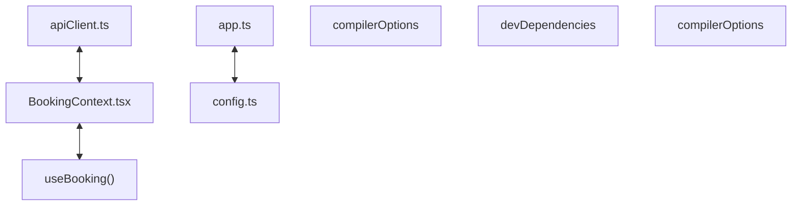

# Codebase Architectural Report

> **Auto-generated** by graphify knowledge graph analysis  
> **Purpose**: Dependency map, connection analysis, subsystem breakdown, and quality hotspots.

---

## 1. Executive Summary

- **Total Components**: `262`
- **Total Connections**: `381`
- **Subsystem Modules**: `1`
- **Dependency Types**: `10`

**Key Architectural Hubs:**

| # | Component | File | Type | Connections |
|---|-----------|------|------|-------------|
| 1 | `app.ts` | `backend/src/app.ts` | file | 24 |
| 2 | `apiClient.ts` | `frontend/lib/apiClient.ts` | file | 21 |
| 3 | `BookingContext.tsx` | `frontend/state/BookingContext.tsx` | class | 17 |
| 4 | `useBooking()` | `frontend/state/BookingContext.tsx` | method | 15 |
| 5 | `compilerOptions` | `frontend/tsconfig.json` | function | 15 |
| 6 | `config.ts` | `backend/src/config.ts` | file | 12 |
| 7 | `devDependencies` | `backend/package.json` | function | 11 |
| 8 | `compilerOptions` | `backend/tsconfig.json` | function | 11 |

---

## 2. Dependency & Connection Analysis

### Relationship Types

| Relationship | Count | Share |
|-------------|-------|-------|
| `contains` | 162 | 43% |
| `imports` | 92 | 24% |
| `imports_from` | 63 | 17% |
| `calls` | 25 | 7% |
| `references` | 14 | 4% |
| `method` | 11 | 3% |
| `extends` | 11 | 3% |
| `indirect_call` | 1 | 0% |
| `rationale_for` | 1 | 0% |
| `inherits` | 1 | 0% |

### Hub Dependency Diagram

### Most Connected Pairs

| Component A | Component B | Shared Connections |
|-------------|-------------|-------------------|
| `build` | `scripts` | 2 |
| `dev` | `scripts` | 2 |
| `scripts` | `start` | 2 |
| `scripts` | `test` | 2 |
| `@types/node` | `devDependencies` | 2 |
| `devDependencies` | `typescript` | 2 |
| `devDependencies` | `vitest` | 2 |
| `@types/node` | `@types/node` | 2 |
| `typescript` | `typescript` | 2 |
| `vitest` | `vitest` | 2 |

---

## 3. Subsystem & Module Breakdown

### 3.1 frontend
**Nodes**: `262`  
**Files**: `backend/package.json`, `backend/src/app.ts`, `backend/src/auth/auth.routes.ts`, `backend/src/auth/auth.service.ts`, `backend/src/booking/booking.routes.ts`, `backend/src/booking/booking.service.ts` +43 more

| Component | Type | File | Connections |
|-----------|------|------|-------------|
| `app.ts` | file | `backend/src/app.ts` | 24 |
| `apiClient.ts` | file | `frontend/lib/apiClient.ts` | 21 |
| `BookingContext.tsx` | class | `frontend/state/BookingContext.tsx` | 17 |
| `useBooking()` | method | `frontend/state/BookingContext.tsx` | 15 |
| `compilerOptions` | function | `frontend/tsconfig.json` | 15 |
| `config.ts` | file | `backend/src/config.ts` | 12 |
| `devDependencies` | function | `backend/package.json` | 11 |
| `compilerOptions` | function | `backend/tsconfig.json` | 11 |
| `devDependencies` | function | `frontend/package.json` | 11 |
| `createApp()` | method | `backend/src/app.ts` | 10 |

**External dependencies:** `NOTE: This file should not be edited` (1)

---

## 4. API Reference

Public classes and functions by subsystem.

### frontend

| Name | Type | File | Connections |
|------|------|------|-------------|
| `BookingContext.tsx` | class | `frontend/state/BookingContext.tsx` | 17 |
| `compilerOptions` | function | `frontend/tsconfig.json` | 15 |
| `devDependencies` | function | `backend/package.json` | 11 |
| `compilerOptions` | function | `backend/tsconfig.json` | 11 |
| `devDependencies` | function | `frontend/package.json` | 11 |
| `theatres/page.tsx` | function | `frontend/app/movies/[movieId]/theatres/page.tsx` | 9 |
| `CheckoutForm.tsx` | class | `frontend/components/CheckoutForm.tsx` | 9 |
| `dashboard/page.tsx` | function | `frontend/app/dashboard/page.tsx` | 8 |

---

## 5. Code Quality & Architectural Risk Hotspots

### Component Type Distribution

| Type | Count | Share |
|------|-------|-------|
| function | 154 | 59% |
| class | 50 | 19% |
| method | 33 | 13% |
| file | 25 | 10% |

### High-Connectivity Hotspots

**3** component(s) with >15 connections:

| Component | File | Connections |
|-----------|------|-------------|
| `app.ts` | `backend/src/app.ts` | 24 |
| `apiClient.ts` | `frontend/lib/apiClient.ts` | 21 |
| `BookingContext.tsx` | `frontend/state/BookingContext.tsx` | 17 |

### Dependency Cycles

**136** circular dependency loop(s) detected:

| # | Cycle Path |
|---|-----------|
| 1 | `frontend_components_theatrelist → frontend_components_theatrelist_theatrelist → frontend_tests_discovery_test` |
| 2 | `frontend_components_theatrelist → frontend_app_movies_movieid_theatres_page → frontend_components_theatrelist_theatrelist` |
| 3 | `frontend_app_movies_movieid_theatres_page_theatrepage → frontend_state_bookingcontext_usebooking → frontend_app_movies_movieid_theatres_page` |
| 4 | `frontend_state_bookingcontext → frontend_state_bookingcontext_usebooking → frontend_app_movies_movieid_theatres_page` |
| 5 | `frontend_components_otpform → frontend_components_otpform_otpform → frontend_state_bookingcontext_usebooking` |
| 6 | `frontend_components_otpform → frontend_app_verify_page → frontend_components_otpform_otpform` |
| 7 | `frontend_lib_apiclient → frontend_components_otpform → frontend_state_bookingcontext_usebooking → frontend_app_movies_movieid_theatres_page` |
| 8 | `frontend_state_bookingcontext → frontend_components_otpform → frontend_state_bookingcontext_usebooking` |
| 9 | `frontend_lib_apiclient → frontend_lib_apiclient_verifyotp → frontend_components_otpform` |
| 10 | `frontend_lib_apiclient → frontend_lib_apiclient_toapierror → frontend_lib_apiclient_verifyotp` |

### Orphaned Components

**9** isolated node(s) with no connections:

| Component | File |
|-----------|------|
| `auth.spec.ts` | `frontend/e2e/auth.spec.ts` |
| `booking.spec.ts` | `frontend/e2e/booking.spec.ts` |
| `discovery.spec.ts` | `frontend/e2e/discovery.spec.ts` |
| `playwright.config.ts` | `frontend/playwright.config.ts` |
| `vitest.config.ts` | `frontend/vitest.config.ts` |
| `Booking Data Persistent SQLite Volume` | `docker-compose.yml` |
| `demo-otp-access Todo` | `todos.yaml` |
| `discovery-and-seats Todo` | `todos.yaml` |
| `checkout-and-confirmation Todo` | `todos.yaml` |

---

## 6. How to Navigate

1. **Interactive D3 Map** — open `graph.html` to explore node connections visually.
2. **Knowledge Graph Queries** — use MCP tools (`graph_query`, `graph_explain_node`, `graph_impact_radius`).
