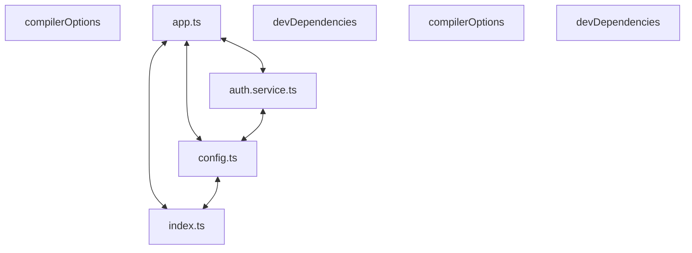

# Codebase Architectural Report

> **Auto-generated** by graphify knowledge graph analysis  
> **Purpose**: Dependency map, connection analysis, subsystem breakdown, and quality hotspots.

---

## 1. Executive Summary

- **Total Components**: `194`
- **Total Connections**: `226`
- **Subsystem Modules**: `1`
- **Dependency Types**: `9`

**Key Architectural Hubs:**

| # | Component | File | Type | Connections |
|---|-----------|------|------|-------------|
| 1 | `compilerOptions` | `frontend/tsconfig.json` | function | 15 |
| 2 | `app.ts` | `backend/src/app.ts` | file | 13 |
| 3 | `devDependencies` | `backend/package.json` | function | 11 |
| 4 | `compilerOptions` | `backend/tsconfig.json` | function | 11 |
| 5 | `devDependencies` | `frontend/package.json` | function | 11 |
| 6 | `auth.service.ts` | `backend/src/auth/auth.service.ts` | file | 10 |
| 7 | `index.ts` | `backend/src/index.ts` | file | 9 |
| 8 | `config.ts` | `backend/src/config.ts` | file | 8 |

---

## 2. Dependency & Connection Analysis

### Relationship Types

| Relationship | Count | Share |
|-------------|-------|-------|
| `contains` | 121 | 54% |
| `imports` | 48 | 21% |
| `imports_from` | 22 | 10% |
| `extends` | 11 | 5% |
| `calls` | 9 | 4% |
| `references` | 7 | 3% |
| `method` | 6 | 3% |
| `indirect_call` | 1 | 0% |
| `inherits` | 1 | 0% |

### Hub Dependency Diagram

### Most Connected Pairs

| Component A | Component B | Shared Connections |
|-------------|-------------|-------------------|
| `build` | `scripts` | 2 |
| `dev` | `scripts` | 2 |
| `scripts` | `start` | 2 |
| `scripts` | `test` | 2 |
| `@types/node` | `devDependencies` | 2 |
| `devDependencies` | `typescript` | 2 |
| `devDependencies` | `vitest` | 2 |
| `@types/node` | `@types/node` | 2 |
| `typescript` | `typescript` | 2 |
| `vitest` | `vitest` | 2 |

---

## 3. Subsystem & Module Breakdown

### 3.1 backend
**Nodes**: `194`  
**Files**: `.engine/workers/4a6467683208/memory/progress_summary.md`, `backend/package.json`, `backend/src/app.ts`, `backend/src/auth/auth.routes.ts`, `backend/src/auth/auth.service.ts`, `backend/src/config.ts` +20 more

| Component | Type | File | Connections |
|-----------|------|------|-------------|
| `compilerOptions` | function | `frontend/tsconfig.json` | 15 |
| `app.ts` | file | `backend/src/app.ts` | 13 |
| `devDependencies` | function | `backend/package.json` | 11 |
| `compilerOptions` | function | `backend/tsconfig.json` | 11 |
| `devDependencies` | function | `frontend/package.json` | 11 |
| `auth.service.ts` | file | `backend/src/auth/auth.service.ts` | 10 |
| `index.ts` | file | `backend/src/index.ts` | 9 |
| `config.ts` | file | `backend/src/config.ts` | 8 |
| `BookingContext.tsx` | class | `frontend/state/BookingContext.tsx` | 8 |
| `dependencies` | function | `backend/package.json` | 7 |

---

## 4. API Reference

Public classes and functions by subsystem.

### backend

| Name | Type | File | Connections |
|------|------|------|-------------|
| `compilerOptions` | function | `frontend/tsconfig.json` | 15 |
| `devDependencies` | function | `backend/package.json` | 11 |
| `compilerOptions` | function | `backend/tsconfig.json` | 11 |
| `devDependencies` | function | `frontend/package.json` | 11 |
| `BookingContext.tsx` | class | `frontend/state/BookingContext.tsx` | 8 |
| `dependencies` | function | `backend/package.json` | 7 |
| `AuthService` | class | `backend/src/auth/auth.service.ts` | 7 |
| `backend/package.json` | function | `backend/package.json` | 6 |

---

## 5. Code Quality & Architectural Risk Hotspots

### Component Type Distribution

| Type | Count | Share |
|------|-------|-------|
| function | 139 | 72% |
| class | 21 | 11% |
| method | 20 | 10% |
| file | 14 | 7% |

### Dependency Cycles

**45** circular dependency loop(s) detected:

| # | Cycle Path |
|---|-----------|
| 1 | `frontend_components_loginform → frontend_state_bookingcontext → frontend_state_bookingcontext_usebooking` |
| 2 | `frontend_components_otpform → frontend_state_bookingcontext → frontend_state_bookingcontext_usebooking` |
| 3 | `frontend_app_layout → frontend_state_bookingcontext_bookingprovider → frontend_state_bookingcontext` |
| 4 | `frontend_state_bookingcontext_bookingcontextvalue → frontend_state_bookingcontext_bookingjourney → frontend_state_bookingcontext` |
| 5 | `frontend_components_otpform → frontend_components_otpform_otpform → frontend_state_bookingcontext_usebooking` |
| 6 | `frontend_components_otpform → frontend_app_verify_page → frontend_components_otpform_otpform` |
| 7 | `frontend_lib_apiclient → frontend_lib_apiclient_verifyotp → frontend_components_otpform` |
| 8 | `frontend_lib_apiclient → frontend_lib_apiclient_toapierror → frontend_lib_apiclient_verifyotp` |
| 9 | `frontend_components_loginform → frontend_lib_apiclient_initiateotp → frontend_lib_apiclient_toapierror → frontend_lib_apiclient_verifyotp → frontend_components_otpform → frontend_state_bookingcontext_usebooking` |
| 10 | `frontend_lib_apiclient → frontend_lib_apiclient_initiateotp → frontend_lib_apiclient_toapierror` |

### Orphaned Components

**4** isolated node(s) with no connections:

| Component | File |
|-----------|------|
| `auth.spec.ts` | `frontend/e2e/auth.spec.ts` |
| `vitest.config.ts` | `frontend/vitest.config.ts` |
| `Native SQLite Runtime Blocker` | `.engine/workers/4a6467683208/memory/progress_summary.md` |
| `TypeScript Typecheck Verification` | `.engine/workers/4a6467683208/memory/progress_summary.md` |

---

## 6. How to Navigate

1. **Interactive D3 Map** — open `graph.html` to explore node connections visually.
2. **Knowledge Graph Queries** — use MCP tools (`graph_query`, `graph_explain_node`, `graph_impact_radius`).
